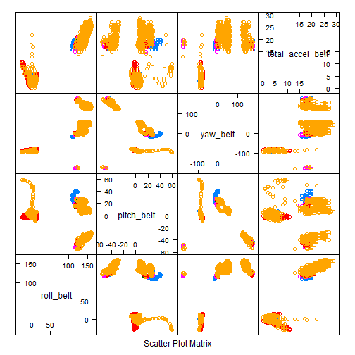

#Prediction Assignment


##Load and preprare the data

This code  will load the data from the working directory.  This code assumes the data has been downloaded to the working directory.


```r
pmltraining <- read.csv("./pml-training.csv", na.strings= c("NA",""," "))
pmltesting <- read.csv("./pml-testing.csv", na.strings= c("NA",""," "))
```

Clean the data by removing columns with NAs & identifier columns.  If we don't remove the extra data columns from the data sets then the randomForest function will not work.  It will error out.


```r
library(caret)
pmltrainingNAs <- apply(pmltraining, 2, function(x) {sum(is.na(x))})
pmltrainingclean <- pmltraining[,which(pmltrainingNAs == 0)]
pmltrainingclean <- pmltrainingclean[8:length(pmltrainingclean)]

pmltestingNAs <- apply(pmltesting, 2, function(x) {sum(is.na(x))})
pmltestingclean <- pmltesting[,which(pmltestingNAs == 0)]
pmltestingclean <- pmltestingclean[8:length(pmltestingclean)]
```

Create a plot to look at the data.


```r
featurePlot(x=pmltrainingclean[,1:4],
            y = pmltrainingclean$classe,
            plot="pairs")
```

 

This lattice plot shows the first 4 columns in the pmltrainingclean data set as the x values and the classe variable is the y variable.


##Build Predictors & Model

Build training and cross validation data sets


```r
inTrain <- createDataPartition(y = pmltrainingclean$classe, p = 0.7, list = FALSE)
training <- pmltrainingclean[inTrain, ]
crossval <- pmltrainingclean[-inTrain, ]
```

Show Summary Stats of Model


```r
summary(training)
```

```
##    roll_belt        pitch_belt          yaw_belt       total_accel_belt
##  Min.   :-28.90   Min.   :-54.7000   Min.   :-180.00   Min.   : 0.00   
##  1st Qu.:  1.09   1st Qu.:  1.7500   1st Qu.: -88.30   1st Qu.: 3.00   
##  Median :113.00   Median :  5.2800   Median : -13.50   Median :17.00   
##  Mean   : 64.13   Mean   :  0.2843   Mean   : -11.49   Mean   :11.28   
##  3rd Qu.:123.00   3rd Qu.: 14.9000   3rd Qu.:  12.60   3rd Qu.:18.00   
##  Max.   :162.00   Max.   : 60.2000   Max.   : 179.00   Max.   :29.00   
##   gyros_belt_x        gyros_belt_y       gyros_belt_z    
##  Min.   :-1.040000   Min.   :-0.64000   Min.   :-1.3500  
##  1st Qu.:-0.050000   1st Qu.: 0.00000   1st Qu.:-0.2000  
##  Median : 0.030000   Median : 0.02000   Median :-0.1000  
##  Mean   :-0.006053   Mean   : 0.03927   Mean   :-0.1307  
##  3rd Qu.: 0.110000   3rd Qu.: 0.11000   3rd Qu.:-0.0200  
##  Max.   : 2.020000   Max.   : 0.63000   Max.   : 1.6200  
##   accel_belt_x       accel_belt_y     accel_belt_z     magnet_belt_x   
##  Min.   :-120.000   Min.   :-54.00   Min.   :-275.00   Min.   :-49.00  
##  1st Qu.: -21.000   1st Qu.:  3.00   1st Qu.:-162.00   1st Qu.:  9.00  
##  Median : -15.000   Median : 33.00   Median :-152.00   Median : 35.00  
##  Mean   :  -5.611   Mean   : 30.05   Mean   : -72.16   Mean   : 55.43  
##  3rd Qu.:  -5.000   3rd Qu.: 61.00   3rd Qu.:  27.00   3rd Qu.: 59.00  
##  Max.   :  85.000   Max.   :164.00   Max.   : 103.00   Max.   :479.00  
##  magnet_belt_y magnet_belt_z       roll_arm         pitch_arm      
##  Min.   :354   Min.   :-621.0   Min.   :-180.00   Min.   :-88.800  
##  1st Qu.:581   1st Qu.:-375.0   1st Qu.: -31.40   1st Qu.:-25.900  
##  Median :601   Median :-319.0   Median :   0.00   Median :  0.000  
##  Mean   :594   Mean   :-345.2   Mean   :  17.95   Mean   : -4.645  
##  3rd Qu.:610   3rd Qu.:-306.0   3rd Qu.:  77.40   3rd Qu.: 11.200  
##  Max.   :673   Max.   : 293.0   Max.   : 179.00   Max.   : 88.500  
##     yaw_arm          total_accel_arm  gyros_arm_x        gyros_arm_y     
##  Min.   :-180.0000   Min.   : 1.00   Min.   :-6.37000   Min.   :-3.4400  
##  1st Qu.: -43.1000   1st Qu.:17.00   1st Qu.:-1.35000   1st Qu.:-0.8000  
##  Median :   0.0000   Median :27.00   Median : 0.06000   Median :-0.2200  
##  Mean   :  -0.6535   Mean   :25.48   Mean   : 0.03642   Mean   :-0.2523  
##  3rd Qu.:  45.4000   3rd Qu.:33.00   3rd Qu.: 1.57000   3rd Qu.: 0.1600  
##  Max.   : 180.0000   Max.   :66.00   Max.   : 4.87000   Max.   : 2.8400  
##   gyros_arm_z       accel_arm_x       accel_arm_y       accel_arm_z     
##  Min.   :-2.3300   Min.   :-404.00   Min.   :-318.00   Min.   :-636.00  
##  1st Qu.:-0.0800   1st Qu.:-240.00   1st Qu.: -54.00   1st Qu.:-143.00  
##  Median : 0.2300   Median : -43.00   Median :  14.00   Median : -47.00  
##  Mean   : 0.2642   Mean   : -59.69   Mean   :  33.15   Mean   : -71.15  
##  3rd Qu.: 0.7200   3rd Qu.:  84.00   3rd Qu.: 140.00   3rd Qu.:  23.00  
##  Max.   : 3.0200   Max.   : 435.00   Max.   : 308.00   Max.   : 245.00  
##   magnet_arm_x     magnet_arm_y     magnet_arm_z  roll_dumbbell    
##  Min.   :-580.0   Min.   :-392.0   Min.   :-597   Min.   :-153.71  
##  1st Qu.:-299.0   1st Qu.: -11.0   1st Qu.: 128   1st Qu.: -16.59  
##  Median : 292.0   Median : 201.0   Median : 443   Median :  48.57  
##  Mean   : 193.7   Mean   : 156.6   Mean   : 306   Mean   :  24.27  
##  3rd Qu.: 638.0   3rd Qu.: 322.0   3rd Qu.: 544   3rd Qu.:  67.97  
##  Max.   : 782.0   Max.   : 583.0   Max.   : 693   Max.   : 153.55  
##  pitch_dumbbell     yaw_dumbbell      total_accel_dumbbell
##  Min.   :-148.50   Min.   :-148.766   Min.   : 0.00       
##  1st Qu.: -40.99   1st Qu.: -77.577   1st Qu.: 5.00       
##  Median : -20.98   Median :  -5.000   Median :11.00       
##  Mean   : -10.70   Mean   :   1.195   Mean   :13.79       
##  3rd Qu.:  17.72   3rd Qu.:  78.482   3rd Qu.:20.00       
##  Max.   : 149.40   Max.   : 154.952   Max.   :42.00       
##  gyros_dumbbell_x  gyros_dumbbell_y   gyros_dumbbell_z  accel_dumbbell_x 
##  Min.   :-1.9900   Min.   :-2.10000   Min.   :-2.3800   Min.   :-237.00  
##  1st Qu.:-0.0300   1st Qu.:-0.14000   1st Qu.:-0.3100   1st Qu.: -51.00  
##  Median : 0.1400   Median : 0.03000   Median :-0.1300   Median :  -9.00  
##  Mean   : 0.1721   Mean   : 0.04364   Mean   :-0.1465   Mean   : -28.72  
##  3rd Qu.: 0.3500   3rd Qu.: 0.21000   3rd Qu.: 0.0300   3rd Qu.:  11.00  
##  Max.   : 2.2200   Max.   : 4.37000   Max.   : 1.8700   Max.   : 235.00  
##  accel_dumbbell_y  accel_dumbbell_z  magnet_dumbbell_x magnet_dumbbell_y
##  Min.   :-182.00   Min.   :-334.00   Min.   :-643.0    Min.   :-744.0   
##  1st Qu.:  -8.00   1st Qu.:-142.00   1st Qu.:-535.0    1st Qu.: 231.0   
##  Median :  43.00   Median :  -1.00   Median :-479.0    Median : 312.0   
##  Mean   :  53.13   Mean   : -38.98   Mean   :-327.7    Mean   : 221.9   
##  3rd Qu.: 113.00   3rd Qu.:  38.00   3rd Qu.:-301.0    3rd Qu.: 391.0   
##  Max.   : 302.00   Max.   : 318.00   Max.   : 592.0    Max.   : 633.0   
##  magnet_dumbbell_z  roll_forearm     pitch_forearm     yaw_forearm     
##  Min.   :-250      Min.   :-180.00   Min.   :-72.50   Min.   :-180.00  
##  1st Qu.: -45      1st Qu.:  -0.81   1st Qu.:  0.00   1st Qu.: -68.90  
##  Median :  13      Median :  22.10   Median :  9.34   Median :   0.00  
##  Mean   :  46      Mean   :  33.61   Mean   : 10.81   Mean   :  19.38  
##  3rd Qu.:  95      3rd Qu.: 140.00   3rd Qu.: 28.40   3rd Qu.: 110.00  
##  Max.   : 451      Max.   : 180.00   Max.   : 89.80   Max.   : 180.00  
##  total_accel_forearm gyros_forearm_x   gyros_forearm_y    gyros_forearm_z 
##  Min.   : 0.00       Min.   :-4.9500   Min.   :-7.02000   Min.   :-7.940  
##  1st Qu.:29.00       1st Qu.:-0.2200   1st Qu.:-1.46000   1st Qu.:-0.180  
##  Median :36.00       Median : 0.0500   Median : 0.03000   Median : 0.080  
##  Mean   :34.76       Mean   : 0.1569   Mean   : 0.07353   Mean   : 0.142  
##  3rd Qu.:41.00       3rd Qu.: 0.5600   3rd Qu.: 1.64000   3rd Qu.: 0.490  
##  Max.   :79.00       Max.   : 3.9700   Max.   : 6.13000   Max.   : 4.100  
##  accel_forearm_x   accel_forearm_y  accel_forearm_z   magnet_forearm_x 
##  Min.   :-498.00   Min.   :-632.0   Min.   :-446.00   Min.   :-1280.0  
##  1st Qu.:-178.00   1st Qu.:  56.0   1st Qu.:-182.00   1st Qu.: -615.0  
##  Median : -57.00   Median : 201.0   Median : -41.00   Median : -379.0  
##  Mean   : -62.04   Mean   : 163.3   Mean   : -55.98   Mean   : -313.5  
##  3rd Qu.:  75.00   3rd Qu.: 313.0   3rd Qu.:  26.00   3rd Qu.:  -75.0  
##  Max.   : 389.00   Max.   : 590.0   Max.   : 287.00   Max.   :  672.0  
##  magnet_forearm_y magnet_forearm_z classe  
##  Min.   :-892.0   Min.   :-973.0   A:3906  
##  1st Qu.:  -2.0   1st Qu.: 193.0   B:2658  
##  Median : 591.0   Median : 512.0   C:2396  
##  Mean   : 379.3   Mean   : 394.4   D:2252  
##  3rd Qu.: 737.0   3rd Qu.: 653.0   E:2525  
##  Max.   :1460.0   Max.   :1090.0
```

Use the randomForest package to fit a model to predict the classe


```r
library(randomForest)
model <- randomForest(classe ~ ., data = training)
```

Crossvalidate the model using the confusionMatrix function to make sure model fits


```r
predictCrossVal <- predict(model, crossval)
confusionMatrix(crossval$classe, predictCrossVal)
```

```
## Confusion Matrix and Statistics
## 
##           Reference
## Prediction    A    B    C    D    E
##          A 1672    1    0    0    1
##          B    7 1129    3    0    0
##          C    0    5 1017    4    0
##          D    0    0   11  953    0
##          E    0    0    0    6 1076
## 
## Overall Statistics
##                                           
##                Accuracy : 0.9935          
##                  95% CI : (0.9911, 0.9954)
##     No Information Rate : 0.2853          
##     P-Value [Acc > NIR] : < 2.2e-16       
##                                           
##                   Kappa : 0.9918          
##  Mcnemar's Test P-Value : NA              
## 
## Statistics by Class:
## 
##                      Class: A Class: B Class: C Class: D Class: E
## Sensitivity            0.9958   0.9947   0.9864   0.9896   0.9991
## Specificity            0.9995   0.9979   0.9981   0.9978   0.9988
## Pos Pred Value         0.9988   0.9912   0.9912   0.9886   0.9945
## Neg Pred Value         0.9983   0.9987   0.9971   0.9980   0.9998
## Prevalence             0.2853   0.1929   0.1752   0.1636   0.1830
## Detection Rate         0.2841   0.1918   0.1728   0.1619   0.1828
## Detection Prevalence   0.2845   0.1935   0.1743   0.1638   0.1839
## Balanced Accuracy      0.9977   0.9963   0.9923   0.9937   0.9989
```

*Kappa Statistic is 0.9936 and this reprsents the out of sample error*


Use the predect function to predict the classes of the testing data set


```r
predictTest <- predict(model, pmltestingclean)
predictTest
```

```
##  1  2  3  4  5  6  7  8  9 10 11 12 13 14 15 16 17 18 19 20 
##  B  A  B  A  A  E  D  B  A  A  B  C  B  A  E  E  A  B  B  B 
## Levels: A B C D E
```
